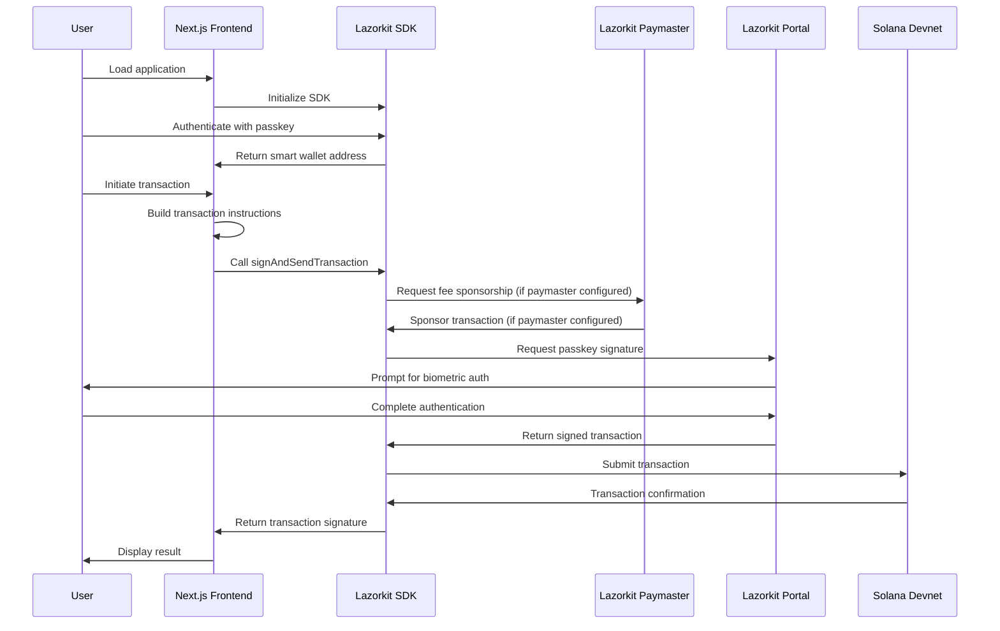

# Architecture Documentation

## System Overview

The application is a Next.js application that demonstrates Lazorkit SDK integration:

1. **Frontend Components**: React components that handle user interface, passkey authentication, and transaction initiation
2. **Lazorkit SDK**: Client-side library that manages passkey credentials, smart wallet operations, and gasless transactions

This demo uses Lazorkit's infrastructure.
- **Paymaster**: Sponsors transaction fees (use this for testing on devnet `https://kora.devnet.lazorkit.com`)
- **Portal**: Handles passkey-based transaction signing, you can also set up your own portal (use this if you don't want to create your own portal `https://portal.lazor.sh`)

> **Note**: Making transactions gasless and sponsoring fee is optional. Developers can choose to sponsor fees, allow users to pay with SOL, or let users pay with SPL-tokens like USDC.

## Component Interaction Flow

## Frontend Responsibilities

### Passkey Authentication
- Using Lazorkit React SDK hooks to register and authenticate users via WebAuthn
- Managing authentication state
- Handling browser compatibility checks

### Smart Wallet Management
- Accessing user's smart wallet address after authentication (handled internally by Lazorkit SDK)
- Displaying wallet information to the user

### Transaction Building
- Constructing Solana transaction instructions (SOL transfer or SPL token transfer) using `@solana/web3.js`
- Validating user inputs
- Creating associated token accounts when needed (for token transfers)

### Transaction Execution
- Calling `signAndSendTransaction` from Lazorkit SDK
- Lazorkit SDK handles: optional fee sponsorship (if paymaster configured), passkey signing, and transaction submission
- Handling transaction responses and errors

### UI State Management
- Managing loading states
- Displaying error messages
- Showing transaction status and Explorer links

## Lazorkit Infrastructure

### Paymaster Service
- **URL**: `https://kora.devnet.lazorkit.com` (Mainnet transaction fees can be sponsored by  paymaster service)
- **Purpose**: Can sponsor transaction fees when configured (optional feature)
- **Integration**: Called by Lazorkit SDK when using `signAndSendTransaction` with paymaster configured
- **Optional**: Fee sponsorship is optional. Without paymaster configuration, users pay standard Solana network fees with their own SOL

### Signing Portal
- **URL**: `https://portal.lazor.sh`
- **Purpose**: Handles passkey-based transaction signing via WebAuthn
- **Integration**: Automatically opened by Lazorkit SDK for transaction signing
- **Requirements**: Requires HTTPS for transaction signing (use ngrok or similar for local development)

## On-Chain Interactions

### Smart Wallet
- Lazorkit SDK manages smart wallet creation and access internally
- The frontend receives the smart wallet address after authentication
- Smart wallets are Lazorkit-managed accounts on Solana

### SOL Transfer
- Standard `SystemProgram.transfer` instruction
- From smart wallet to recipient address
- Fees sponsored by Lazorkit paymaster (if configured - fee sponsorship is optional)

### SPL Token Transfer
- `TokenProgram.transfer` instruction
- From smart wallet's token account to recipient's token account
- Associated token accounts are created automatically if needed
- Fees sponsored by Lazorkit paymaster (if configured - fee sponsorship is optional)

## Data Flow

### Authentication Flow
1. User initiates registration or login
2. Frontend calls Lazorkit SDK `connect()` method
3. Browser prompts for biometric authentication
4. Lazorkit SDK handles WebAuthn credential creation/verification
5. Smart wallet address is provided to frontend
6. Frontend updates UI with wallet information

### Transaction Flow
1. User initiates transaction (enters recipient, amount)
2. Frontend builds transaction instructions with user's smart wallet as sender
3. Frontend calls `signAndSendTransaction` from Lazorkit SDK with instructions
4. Lazorkit SDK sends transaction to paymaster for optional fee sponsorship (if paymaster configured)
5. Lazorkit SDK opens portal for passkey-based transaction signing
6. User completes biometric authentication
7. Portal signs transaction with passkey
8. Lazorkit SDK submits fully signed transaction to Solana Devnet
9. Lazorkit SDK returns transaction signature to frontend
10. Frontend displays success message and Explorer link

## Security Considerations

### Passkey Security
- Passkeys are stored in device Secure Enclave
- Private keys never leave the device
- Biometric authentication required for each transaction

### Transaction Validation
- Frontend validates user inputs
- Lazorkit SDK validates transaction structure
- Users should review transaction details before signing

## Limitations

- **Devnet Only**: All transactions are on Solana Devnet
- **Single Device**: Passkeys are device-bound; no cross-device wallet access
- **No production security**: This is a demo repository, not production-ready
- **No transaction history**: Transactions are not persisted
- **HTTPS required**: Transaction signing requires HTTPS (use ngrok or similar for local dev)

## Future Enhancements

- Transaction history persistence
- Better error handling and recovery
- Transaction batching support
- Multi-device passkey support
- Mainnet deployment guide
